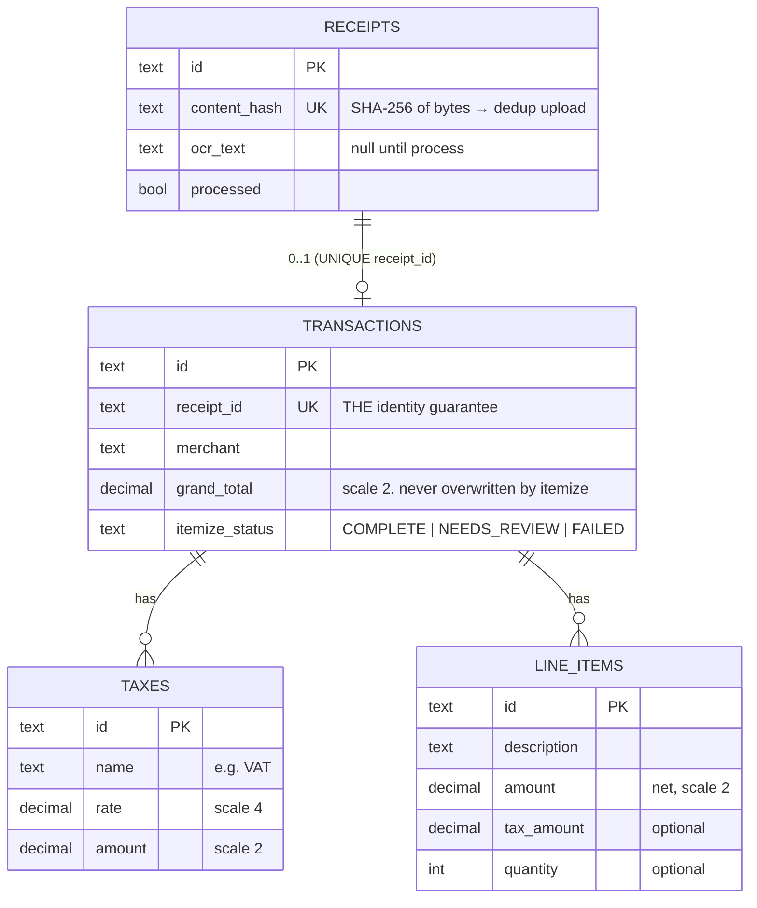
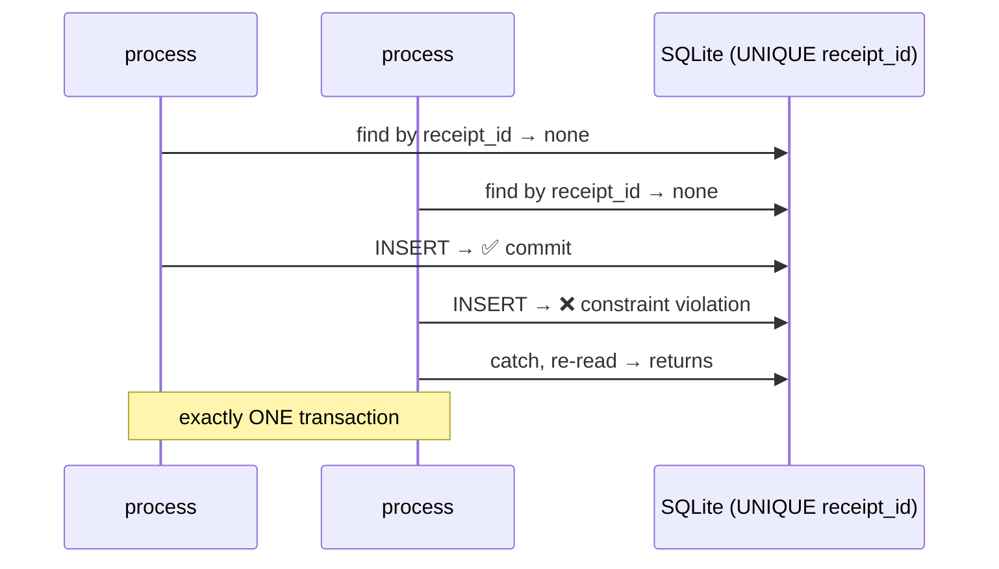

# Architecture

One page: the data model, and the three invariants that matter — **identity**,
**concurrency**, **atomicity**. Fuller rationale lives in [docs/DESIGN.md](docs/DESIGN.md).

## Layering

```
HTTP ─▶ Controller ─▶ Service (@Transactional) ─▶ Repository ─▶ SQLite
                         │
          OcrService (stub) + ReceiptExtractor   ← parsing, DB-free
```

Controllers do HTTP only; services own the transactional logic; parsing is
isolated in `ReceiptExtractor`. No class does routing + parsing + storage.

## Data model

One receipt maps to **at most one** transaction; a transaction owns many taxes
and many line items.



Money is `BigDecimal` (amounts scale 2, rates scale 4) — never `float`.

## 1. Identity — one receipt → one transaction

The **`UNIQUE` constraint on `transactions.receipt_id`** is the guarantee —
enforced by the database, not an application `if`. `process` is a transactional
**upsert**: find the transaction for this `receipt_id`; insert if absent, update
in place if present. Re-processing always targets the same row.

## 2. Concurrency — two overlapping `process` calls

Both callers may see "no transaction yet" and race to insert. The unique
constraint lets exactly one win; the loser is caught and re-reads the winner's row.



No lock service. SQLite serializes writers; the constraint makes the guarantee
**portable** — the same code gives true row-level concurrency on Postgres.

## 3. Atomicity — one `process` = one commit

Header + tax rows + line items + OCR text persist together or not at all (single
`@Transactional` method). Re-processing **deletes existing children and
re-inserts within the same transaction**, so no duplicate or orphaned rows
accumulate. Parse failure (missing merchant/date/currency/total) → **422**,
persisting nothing — we never store an `"Unknown"` / `0.00` placeholder.

## Reconciliation

Line items are **net**. A transaction reconciles iff:

```
sum(line_items.amount) + sum(taxes.amount) == grand_total   (exact, scale 2)
```

`COMPLETE` requires ≥1 item **and** reconciliation; otherwise `NEEDS_REVIEW`.
We never invent a balancing line or rewrite the total.
