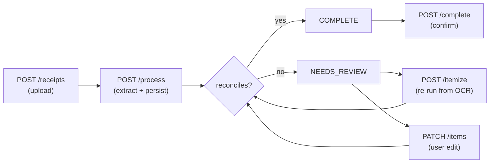

# Receipt Auto-Itemize API

Upload a receipt → the service stores it, then on `process` extracts a
transaction **header**, **tax rows**, and **auto-itemized line items**, and
persists them atomically. If items + taxes don't reconcile with the printed
total, the transaction is kept and flagged `NEEDS_REVIEW` — no fake balancing
line, no rewritten total.

> **OCR is stubbed.** The fixture files are already text, so `process` reads the
> stored file verbatim and parses it. No OCR/LLM vendor is called; no API keys.

**Stack:** Java 21 · Spring Boot 4 · Spring Data JPA / Hibernate · **on-disk SQLite**
(`data/receipts.db`, auto-created) · `BigDecimal` money (amounts scale 2, rates scale 4).

## Run

Requires **JDK 21**. On macOS: `export JAVA_HOME=$(/usr/libexec/java_home -v 21)`

```bash
./mvnw spring-boot:run
```

Starts on **http://localhost:8080**. Health check: `curl localhost:8080/health`

## Test

```bash
./mvnw test
```

69 tests (MockMvc over the real HTTP API + SQLite), covering all 9 required
scenarios. See [docs/API_TEST_PLAN.md](docs/API_TEST_PLAN.md) for a live
endpoint-by-endpoint run.

## Lifecycle



## Endpoints

| Method | Path | Behavior |
|---|---|---|
| `GET` | `/health` | Liveness. |
| `POST` | `/receipts` | Multipart upload. Duplicate bytes → existing id (**200**, idempotent via SHA-256). |
| `GET` | `/receipts/{id}` | Receipt + `transaction_id` if processed. **404** if missing. |
| `GET` | `/receipts/{id}/ocr` | Stored OCR text. **409** if not processed yet. |
| `POST` | `/receipts/{id}/process` | Create-or-update the one transaction (**201**/**200**). **422** if unparseable. |
| `DELETE` | `/receipts/{id}` | Delete if unprocessed (**204**); **409** if a transaction exists. |
| `GET` | `/transactions/{id}` | Header + taxes + line items + status. |
| `GET` | `/transactions?receipt_id={id}` | The one transaction, or **404**. Never a list. |
| `POST` | `/transactions/{id}/itemize` | Re-itemize from stored OCR; replaces line items only. |
| `PATCH` | `/transactions/{id}/items` | Edit/merge/split. **409 + mismatch payload** if it doesn't reconcile; persists nothing. |
| `POST` | `/transactions/{id}/complete` | Set `COMPLETE` only if it reconciles; else **409**, status unchanged. |

## Example walkthrough (every endpoint)

```bash
BASE=http://localhost:8080

# 1. health
curl $BASE/health

# 2. upload  → returns {"receipt_id": "..."}
RID=$(curl -s -F file=@fixtures/task-a/receipt-clean.txt $BASE/receipts | jq -r .receipt_id)

# 3. get receipt (processed:false, transaction_id:null)
curl $BASE/receipts/$RID

# 4. process  → 201 + Location header, returns {"id": "<txn>", ...}
TID=$(curl -s -X POST $BASE/receipts/$RID/process | jq -r .id)

# 5. process AGAIN on the same id  → 200, SAME txn id (no second transaction)
curl -s -X POST $BASE/receipts/$RID/process | jq -r .id

# 6. stored OCR text
curl $BASE/receipts/$RID/ocr

# 7. get transaction (taxes + line_items + itemize_status)
curl $BASE/transactions/$TID

# 8. get by receipt_id (same txn, never a list)
curl "$BASE/transactions?receipt_id=$RID"

# 9. re-itemize from stored OCR
curl -X POST $BASE/transactions/$TID/itemize

# 10. PATCH that doesn't reconcile  → 409 + mismatch payload, nothing persisted
curl -i -X PATCH $BASE/transactions/$TID/items \
  -H 'Content-Type: application/json' \
  -d '{"line_items":[{"description":"Too little","amount":5.00}]}'

# 11. complete (clean reconciles)  → 200 COMPLETE
curl -X POST $BASE/transactions/$TID/complete

# 12. DELETE a processed receipt  → 409, transaction untouched
curl -i -X DELETE $BASE/receipts/$RID
```

## Documentation

- [ARCHITECTURE.md](ARCHITECTURE.md) — data model + identity / concurrency / atomicity (with diagrams).
- [docs/DESIGN.md](docs/DESIGN.md) — full design rationale and documented decision forks.
- [docs/API_TEST_PLAN.md](docs/API_TEST_PLAN.md) — live 40-case endpoint verification.
